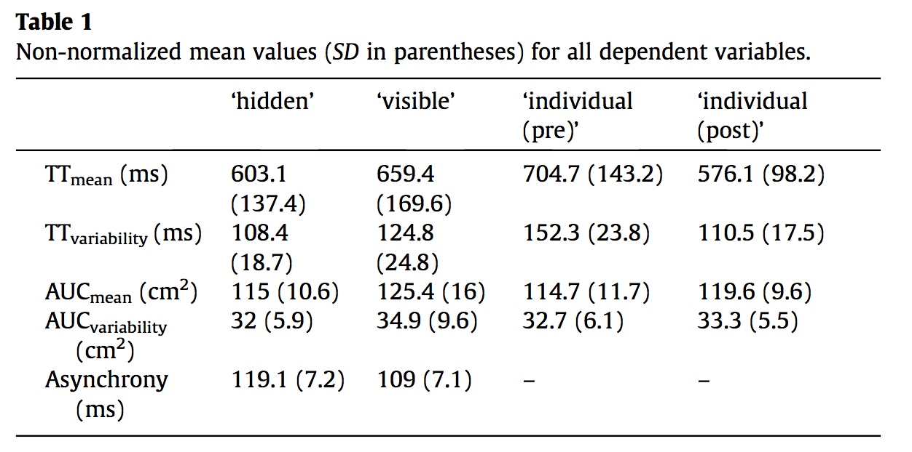

#### Article ID: rggwx
#### Pilot: Michael Henry Tessler
#### Co-pilot: Tom Hardwicke  
#### Start date: 07/13/2017
#### End date: 10/18/2017

-------

#### Methods summary: 

The authors are interested in coordinated movements in situations where co-actors share visual access to a scene and do not share visual access to a scene. Participants play a video game where you have to drag a cursor from a "space ship" to a "planet" on the computer screen, while occasionally having to avoid "asteriods". The goal is to arrive at the planet at the same time as your partner, and in some conditions, you can see your partner's screen ("visible" condition) and in others, there is a sheet separating the two of you so you cannot see the partner's screen ("hidden" condition). The authors have two measures: "mean time to target" (TT) and area under the curve of the trajectory (AUC). These are compared via their means and standard deviations, both normalized and unnormalized. 

------

#### Target outcomes: 

> 3.1. Effects of visibility
> We compared co-actors’ normalized performance between the ‘hidden’ and ‘visible’ conditions (Fig. 2; for the non-normalized data see Table 1). In line with our hypothesis that co-actors would try to reduce the temporal variability of their actions when they could not see each other, performance was not only faster (smaller normalized TTmean), t(15) = −3.29, p < 0.01, Cohen’s d = −0.82, but also less variable (smaller normalized TTvariability), t(15) = −2.52, p < 0.05, Cohen’s d = −0.63, in the ‘hidden’ condition. In line with our hypothesis that co-actors would modulate movement parameters in a communicative manner when they could see each other, the analysis of normalized AUCmean showed a larger area under the curve in the ‘visible’ condition, t(15) = −3.82, p < 0.01, Cohen’s d = −0.96. The difference in variability of curvature (normalized AUCvariability), t(15) = −1.4, p > 0.1, Cohen’s d = −0.35, was not significant.

------

```{r global_options, include=FALSE}
knitr::opts_chunk$set(echo=TRUE, warning=FALSE, message=FALSE)
```

## Step 1: Load packages


```{r}
library(tidyverse) # for data munging
library(knitr) # for kable table formating
library(haven) # import and export 'SPSS', 'Stata' and 'SAS' Files
library(readxl) # import excel files
library(CODreports) # custom report functions
library(lsr) # for Cohens d calculation
library(pipeR) # for code formatting
```

## Step 2: Load data

```{r}
df <- read.csv("data/data.csv")
str(df)
```

Many of the column names are of the form "Title (value1, value2)". I assume the "value1" and "value2" correspond to the labels of the factor, in numerical order. For example, if the column has values 1 and 2, and the header says "Target Position (center / margin)", it will be assumed that "center" = 1 and "margin" = 2.

However, in their Error column, it is listed "Error (yes / no)". Following the convention I describe above, that would mean that Yes Error corresponds to 0 and No Error corresponds to 1. I think that is unlikely (plus, there are many more 0s than 1s), so I will treat 0 as No Error and 1 as Error.


## Step 3: Tidy data

```{r}
df.tidy <- df %>%
  mutate(Condition = factor(Condition.individual.pre.hidden.visible.individual.post.,
                            levels = c(1,2,3,4),
                            labels = c("Individual Pre", "Hidden", 
                                       "Visible", "Individual Post")),
         TargetSize = factor(TargetSize.small.large., levels = c(1,2), 
                             labels = c("small", "large")),
         TargetPosition = factor(TargetPosition.center.margin., 
                                 levels = c(1, 2),
                                 labels = c("center", "margin")),
         ObstaclePresence = factor(ObstaclePresence.absent.present.,
                                   levels = c(0, 1),
                                   labels = c("absent", "present")),
         Error = Error.yes.no.) %>%
  select(-Condition.individual.pre.hidden.visible.individual.post.,
         -TargetSize.small.large.,
         -TargetPosition.center.margin., 
         -ObstaclePresence.absent.present.,
         -Error.yes.no.)
```

## Step 4: Run analysis

### Pre-processing

From Section 2.3 Data Analysis:

> Trials in which participants’ TT was more than 1600 ms or in which they touched an obstacle were excluded (1.2% of all trials). 

```{r}
df.tidy <- df.tidy %>%
  mutate(excluded = ifelse((TT > 1.6) | (Error == 1), 1, 0))

mean(df.tidy$Error)
mean(df.tidy$excluded)

# are there any cases where the error column does not match the excluded colum?
any(df.tidy$Error != df.tidy$excluded) # nope

# how many trials are we excluding?
trials_withExclusions <- nrow(df.tidy %>% filter(excluded != 1))
trials_withoutExclusions <- nrow(df.tidy)

percentExcluded <- 100*(1-trials_withExclusions/trials_withoutExclusions) # as a percentage
```

Looks like the "Error" column includes all the cases where TT > 1.6 as well as some more (possibly the other exclusion criterion: participant touched an obstacle). But I get `r round(percentExcluded, 2)`% excluded, whereas the authors report 1.2%.

```{r}
compareValues(reportedValue = 1.20, obtainedValue = 1.35)
```

NB - author's have provided assistance - after re-running the analysis themselves they found that the error rate was misreported. They obtain a 1.35% rate, whis what we obtain. No ready explanation for this issue is avaialble.

> In order to not inflate statistical power, dependent variables from the remaining trials were first aggregated on an individual participant level and then averaged over the two members of a pair. 

NOTE - author assistance - the author has provided additional information about this step as below:

> For each parameter (column 11 and 12): For all four conditions separately (different numbers in column 3):
        Average [or compute standard deviation] per stimulus type according to column 6, i.e. get 8 different means per person.
        Average the 8 stimulus type averages, still per person.
        Average the two persons within a pair.

> This gives you the absolute values reported in Table 1.

```{r}
df.pair.condition.summary <- df.tidy %>>%
  filter(!excluded) %>%
  group_by(Condition, Pair, Subject, StimulusType) %>>%
  summarize(TT_mean1 = mean(TT),
            TT_variability1 = sd(TT),
            AUC_mean1 = mean(AUC),
            AUC_variability1 = sd(AUC),
            Asynchrony_mean1 = mean(Asynchrony)) %>>%
  ungroup() %>>%
  group_by(Condition, Pair, Subject) %>>%
  summarize(TT_mean2 = mean(TT_mean1),
            TT_variability2 = mean(TT_variability1),
            AUC_mean2 = mean(AUC_mean1),
            AUC_variability2 = mean(AUC_variability1),
            Asynchrony_mean2 = mean(Asynchrony_mean1)) %>>%
  ungroup() %>>%
  group_by(Condition, Pair) %>>%
  summarize(TT_mean3 = mean(TT_mean2),
          TT_variability3 = mean(TT_variability2),
          AUC_mean3 = mean(AUC_mean2),
          AUC_variability3 = mean(AUC_variability2),
          Asynchrony_mean3 = mean(Asynchrony_mean2)) %>>%
  ungroup() %>>%
  (~d.summary) %>>%
  group_by(Condition) %>>%
  summarize(TT_mean = mean(TT_mean3*1000),
            TT_sd = sd(TT_mean3*1000),
            TT_variability = mean(TT_variability3)*1000,
            TT_variability_sd = sd(TT_variability3*1000),
            AUC_mean = mean(AUC_mean3),
            AUC_sd = sd(AUC_mean3),
            AUC_variability = mean(AUC_variability3),
            AUC_variability_sd = sd(AUC_variability3),
            Asynchrony_mean = mean(Asynchrony_mean3*1000),
            Asynchrony_sd = sd(Asynchrony_mean3*1000)) %>>%
  kable(digits = 1)
```



Note, there appear to be three discrepancies. All sds:

```{r}
compareValues(reportedValue = 9.6, obtainedValue = 12.1)
compareValues(reportedValue = 7.2, obtainedValue = 29.64)
compareValues(reportedValue = 7.1, obtainedValue = 29.14)
```

NB - we checked with the authors, and they confirm that they also cannot reproduce these three values. When they repeat their analysis, they get the same values as we do (i.e., not the values reported in the paper). Suggested cause = typo.

> All dependent variables (TT, AUC, asynchrony; reported in Table 1) were normalized by dividing data from each joint condition by the ‘individual (pre)’ condition acquired in the beginning of the experiment. 

> Normalized performance in the ‘hidden’ and ‘visible’ conditions were compared with pairwise t-tests and also tested with one-sample t-tests against 1 to detect differences to baseline performance (‘individual (pre)’). Where appropriate, Bonferroni-correction was applied. The influence of TT and AUC on asynchrony was tested with separate multiple regression analyses (‘enter’ method, IBM SPSS 22).

>  In line with our hypothesis that co-actors would try to reduce the temporal variability of their actions when they could not see each other, performance was not only faster (smaller normalized TTmean), t(15) = −3.29, p < 0.01, Cohen’s d = −0.82, 


```{r}
# tt.mean
d.normalized <- d.summary %>%
  filter(Condition %in% c('Hidden', 'Visible', 'Individual Pre')) %>%
  select(Condition, Pair, TT_mean = TT_mean3) %>%
  spread(Condition, TT_mean) %>%
  mutate(Hidden_normalized = Hidden / `Individual Pre`,
         Visible_normalized = Visible / `Individual Pre`)

t.test(d.normalized$Hidden_normalized, d.normalized$Visible_normalized, paired = T)
```
MATCH.

```{r}
cohensD(d.normalized$Hidden_normalized, d.normalized$Visible_normalized, method = 'paired')
```
MATCH.

> but also less variable (smaller normalized TTvariability), t(15) = −2.52, p < 0.05, Cohen’s d = −0.63, in the ‘hidden’ condition. 

```{r}
# tt.variability
d.normalized <- d.summary %>%
  filter(Condition %in% c('Hidden', 'Visible', 'Individual Pre')) %>%
  select(Condition, Pair, TT_variability = TT_variability3) %>%
  spread(Condition, TT_variability) %>%
  mutate(Hidden_normalized = Hidden / `Individual Pre`,
         Visible_normalized = Visible / `Individual Pre`)

t.test(d.normalized$Hidden_normalized, d.normalized$Visible_normalized, paired = T)
```
MATCH.

```{r}
cohensD(d.normalized$Hidden_normalized, d.normalized$Visible_normalized, method = 'paired')
```

MATCH.

> In line with our hypothesis that co-actors would modulate movement parameters in a communicative manner when they could see each other, the analysis of normalized AUCmean showed a larger area under the curve in the ‘visible’ condition, t(15) = −3.82, p < 0.01, Cohen’s d = −0.96. 

```{r}
# AUCmean
d.normalized <- d.summary %>%
  filter(Condition %in% c('Hidden', 'Visible', 'Individual Pre')) %>%
  select(Condition, Pair, AUC_mean = AUC_mean3) %>%
  spread(Condition, AUC_mean) %>%
  mutate(Hidden_normalized = Hidden / `Individual Pre`,
         Visible_normalized = Visible / `Individual Pre`)

t.test(d.normalized$Hidden_normalized, d.normalized$Visible_normalized, paired = T)
```
MATCH.

```{r}
cohensD(d.normalized$Hidden_normalized, d.normalized$Visible_normalized, method = 'paired')
```
MATCH.

> The difference in variability of curvature (normalized AUCvariability), t(15) = −1.4, p > 0.1, Cohen’s d = −0.35, was not significant.

```{r}
# AUCmean
d.normalized <- d.summary %>%
  filter(Condition %in% c('Hidden', 'Visible', 'Individual Pre')) %>%
  select(Condition, Pair, AUC_variability = AUC_variability3) %>%
  spread(Condition, AUC_variability) %>%
  mutate(Hidden_normalized = Hidden / `Individual Pre`,
         Visible_normalized = Visible / `Individual Pre`)

t.test(d.normalized$Hidden_normalized, d.normalized$Visible_normalized, paired = T)
```
MATCH.

```{r}
cohensD(d.normalized$Hidden_normalized, d.normalized$Visible_normalized, method = 'paired')
```

MATCH.

## Step 5: Conclusion

```{r}
codReport(Report_Type = 'joint',
          Article_ID = 'rggwx', 
          Insufficient_Information_Errors = 1,
          Decision_Errors = 0, 
          Major_Numerical_Errors = 4, 
          Minor_Numerical_Errors = 0,
          Author_Assistance = T)
```

We first encountered a problem implementing the excusion criteria. The exclusion rate we encountered did not match the one reported. After corresponding with the author, it transpired that the reported exclusion rate was incorrect, and in their reanalysis the author obtained the same value that we did (major error 1).

We then encountered numerous errors reproducing the descriptive statistics (Table 1). But the authors suggested that there was an additional aggregation step that had not been reported in the article (insufficient information error 1). When we implemented this step, we were able to reproduce most values. However, three errors for three standard deviations reported in table 1 remained (major errors 2, 3, and 4). The authors found that they could also not reproduce these three reported values in their own reanalysis, and their findings concurred with our own. They suggested that there the errors may have arisen when copying from the analysis output to the manuscript.

None of the errors appear to effect the substantive conclusions of the paper.


```{r session_info, include=TRUE, echo=TRUE, results='markup'}
devtools::session_info()
```
