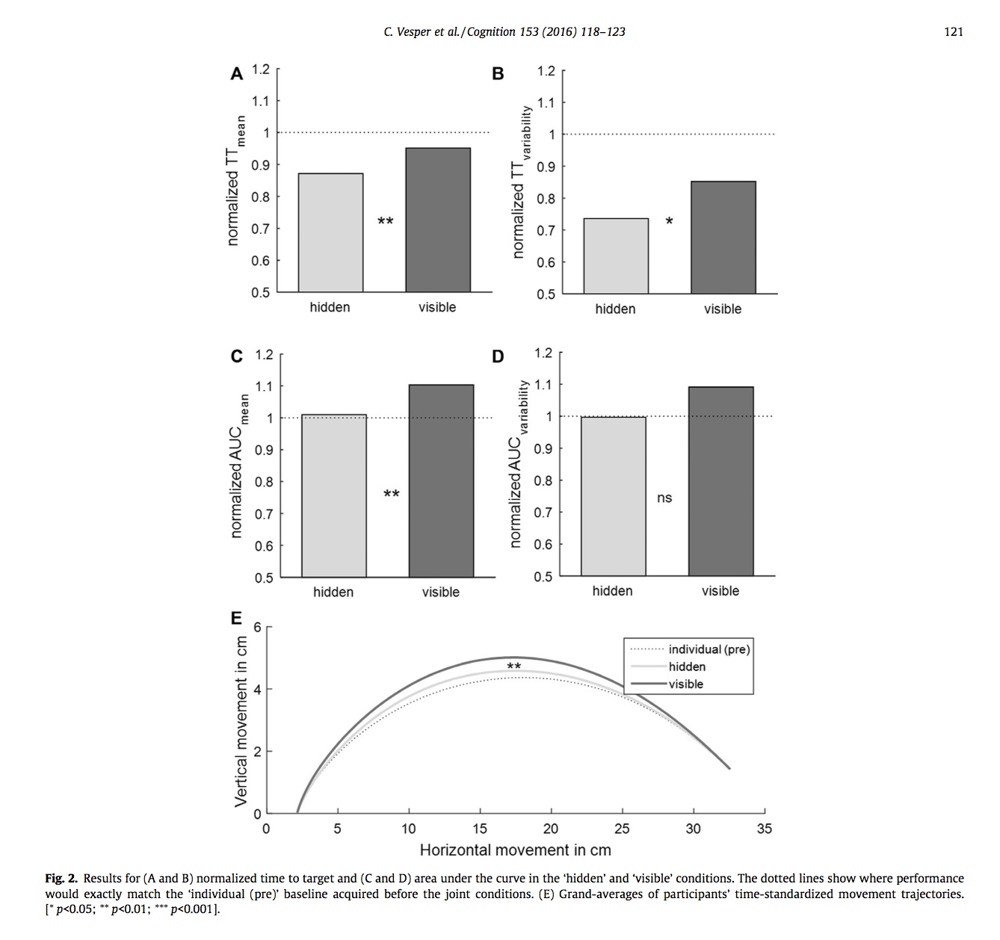

#### Article ID: rggwx
#### Pilot: Michael Henry Tessler
#### Co-pilot: Tom Hardwicke  
#### Start date: 07/13/2017
#### End date: [Insert end date - use US format]   

-------

#### Methods summary: 

The authors are interested in coordinated movements in situations where co-actors share visual access to a scene and do not share visual access to a scene. Participants play a video game where you have to drag a cursor from a "space ship" to a "planet" on the computer screen, while occasionally having to avoid "asteriods". The goal is to arrive at the planet at the same time as your partner, and in some conditions, you can see your partner's screen ("visible" condition) and in others, there is a sheet separating the two of you so you cannot see the partner's screen ("hidden" condition). The authors have two measures: "mean time to target" (TT) and area under the curve of the trajectory (AUC). These are compared via their means and standard deviations, both normalized and unnormalized. 

------

#### Target outcomes: 

> 3.1. Effects of visibility
> We compared co-actors’ normalized performance between the ‘hidden’ and ‘visible’ conditions (Fig. 2; for the non-normalized data see Table 1). In line with our hypothesis that co-actors would try to reduce the temporal variability of their actions when they could not see each other, performance was not only faster (smaller normalized TTmean), t(15) = −3.29, p < 0.01, Cohen’s d = −0.82, but also less variable (smaller normalized TTvariability), t(15) = −2.52, p < 0.05, Cohen’s d = −0.63, in the ‘hidden’ condition. In line with our hypothesis that co-actors would modulate movement parameters in a communicative manner when they could see each other, the analysis of normalized AUCmean showed a larger area under the curve in the ‘visible’ condition, t(15) = −3.82, p < 0.01, Cohen’s d = −0.96. The difference in variability of curvature (normalized AUCvariability), t(15) = −1.4, p > 0.1, Cohen’s d = −0.35, was not significant.

------

```{r global_options, include=FALSE}
knitr::opts_chunk$set(echo=TRUE, warning=FALSE, message=FALSE)
```

## Step 1: Load packages


```{r}
library(tidyverse) # for data munging
library(knitr) # for kable table formating
library(haven) # import and export 'SPSS', 'Stata' and 'SAS' Files
library(readxl) # import excel files
library(CODreports) # custom report functions
library(effsize)
```

## Step 2: Load data

```{r}
df <- read.csv("data/data.csv")
str(df)
```

Many of the column names are of the form "Title (value1, value2)". I assume the "value1" and "value2" correspond to the labels of the factor, in numerical order. For example, if the column has values 1 and 2, and the header says "Target Position (center / margin)", it will be assumed that "center" = 1 and "margin" = 2.

However, in their Error column, it is listed "Error (yes / no)". Following the convention I describe above, that would mean that Yes Error corresponds to 0 and No Error corresponds to 1. I think that is unlikely (plus, there are many more 0s than 1s), so I will treat 0 as No Error and 1 as Error.


## Step 3: Tidy data

```{r}
df.tidy <- df %>%
  mutate(Condition = factor(Condition.individual.pre.hidden.visible.individual.post.,
                            levels = c(1,2,3,4),
                            labels = c("Individual Pre", "Hidden", 
                                       "Visible", "Individual Post")),
         TargetSize = factor(TargetSize.small.large., levels = c(1,2), 
                             labels = c("small", "large")),
         TargetPosition = factor(TargetPosition.center.margin., 
                                 levels = c(1, 2),
                                 labels = c("center", "margin")),
         ObstaclePresence = factor(ObstaclePresence.absent.present.,
                                   levels = c(0, 1),
                                   labels = c("absent", "present")),
         Error = Error.yes.no.) %>%
  select(-Condition.individual.pre.hidden.visible.individual.post.,
         -TargetSize.small.large.,
         -TargetPosition.center.margin., 
         -ObstaclePresence.absent.present.,
         -Error.yes.no.)
```

## Step 4: Run analysis

### Pre-processing

From Section 2.3 Data Analysis:

> Trials in which participants’ TT was more than 1600 ms or in which they touched an obstacle were excluded (1.2% of all trials). 

```{r}
df.tidy <- df.tidy %>%
  mutate(excluded = ifelse((TT > 1.6) | (Error == 1), 1, 0))

mean(df.tidy$Error)
mean(df.tidy$excluded)

# are there any cases where the error column does not match the excluded colum?
any(df.tidy$Error != df.tidy$excluded) # nope

# how many trials are we excluding?
trials_withExclusions <- nrow(df.tidy %>% filter(excluded != 1))
trials_withoutExclusions <- nrow(df.tidy)

percentExcluded <- 100*(1-trials_withExclusions/trials_withoutExclusions) # as a percentage
```

Looks like the "Error" column includes all the cases where TT > 1.6 as well as some more (possibly the other exclusion criterion: participant touched an obstacle). But I get `r round(percentExcluded, 2)`% excluded, whereas the authors report 1.2%.

> In order to not inflate statistical power, dependent variables from the remaining trials were first aggregated on an individual participant level and then averaged over the two members of a pair. All dependent variables (TT, AUC, asynchrony; reported in Table 1) were normalized by dividing data from each joint condition by the ‘individual (pre)’ condition acquired in the beginning of the experiment. 

```{r}
df.pair.condition.summary <- df.tidy %>%
  filter(!excluded) %>%
  group_by(Pair, Subject, Condition) %>%
  summarize(TT_mean = mean(TT),
            TT_variability = sd(TT),
            AUC_mean = mean(AUC),
            AUC_variability = sd(AUC),
            Asynchrony_mean = mean(Asynchrony)) %>%
  ungroup() %>%
  group_by(Pair, Condition) %>%
  summarize(TT_mean = mean(TT_mean),
            TT_variability = mean(TT_variability),
            AUC_mean = mean(AUC_mean),
            AUC_variability = mean(AUC_variability),
            Asynchrony_mean = mean(Asynchrony_mean)) %>%
  gather(key, value, -Pair, -Condition) %>%
  spread(Condition, value) %>%
  mutate(Hidden_normalized = Hidden / `Individual Pre`,
         Visible_normalized = Visible / `Individual Pre`)
```


> Normalized performance in the ‘hidden’ and ‘visible’ conditions were compared with pairwise t-tests and also tested with one-sample t-tests against 1 to detect differences to baseline performance (‘individual (pre)’). Where appropriate, Bonferroni-correction was applied. The influence of TT and AUC on asynchrony was tested with separate multiple regression analyses (‘enter’ method, IBM SPSS 22).


### Descriptive statistics

I will reproduce all of the Cohen's d's reported in Section 3.1 Effects of Variability.

```{r}
reported_descriptives <- list(
  TT_mean = -0.82,
  TT_variability = -0.63,
  AUC_mean = -0.96,
  AUC_variability = -0.35
)

d_TT_mean <- with(df.pair.condition.summary %>% filter(key == "TT_mean"),
     cohen.d(Hidden_normalized, Visible_normalized, paired = T))

d_TT_variability <- with(df.pair.condition.summary %>% filter(key == "TT_variability"),
     cohen.d(Hidden_normalized, Visible_normalized, paired = T))

d_AUC_mean <- with(df.pair.condition.summary %>% filter(key == "AUC_mean"),
     cohen.d(Hidden_normalized, Visible_normalized, paired = T))

d_AUC_variability <- with(df.pair.condition.summary %>% filter(key == "AUC_variability"),
     cohen.d(Hidden_normalized, Visible_normalized, paired = T))


compareValues(reported_descriptives$TT_mean, d_TT_mean$estimate)
compareValues(reported_descriptives$TT_variability, d_TT_variability$estimate)
compareValues(reported_descriptives$AUC_mean, d_AUC_mean$estimate)
compareValues(reported_descriptives$AUC_variability, d_AUC_variability$estimate)
```

3 minor numerical errors and 1 major numerical error for AUC_variability.

```{r}
df.pair.condition.summary %>%
  ungroup() %>%
  gather(condition, val, -key) %>%
  group_by(key, condition) %>%
  summarize(ave = mean(val)) %>%
  filter(condition %in% c("Hidden_normalized", "Visible_normalized"),
         key != "Asynchrony_mean") %>%
  ungroup() %>%
  mutate(key = factor(key, levels = c("TT_mean", "TT_variability", 
                                      "AUC_mean", "AUC_variability"))) %>%
  ggplot(., aes(x = condition, y = ave, fill = condition))+
  geom_col(color = 'black')+
  facet_wrap(~key)+
  theme(axis.text.x = element_blank())+
  geom_hline(yintercept = 1, lty = 3)
```



```{r}
df.pair.condition.summary %>%
  ungroup() %>%
  gather(condition, val, -key, -Pair) %>%
  group_by(key, condition) %>%
  summarize(ave = mean(val),
            sd = sd(val) )%>%
  filter(!(condition %in% c("Hidden_normalized", "Visible_normalized"))) %>%
  ungroup() %>%
  mutate(key = factor(key, levels = c("TT_mean", "TT_variability", 
                                      "AUC_mean", "AUC_variability",
                                      "Asynchrony_mean")),
         values = paste(
           as.character(round(ave, 3)), " (", as.character(round(sd, 3)), ")",
           sep = ""
         )) %>%
  select(-ave, -sd) %>%
  spread(condition, values) %>% 
  select(key, Hidden, Visible, `Individual Pre`, `Individual Post`) %>% kable()
```


### Inferential statistics

> We compared co-actors’ normalized performance between the ‘hidden’ and ‘visible’ conditions (Fig. 2; for the non-normalized data see Table 1). In line with our hypothesis that co-actors would try to reduce the temporal variability of their actions when they could not see each other, performance was not only faster (smaller normalized TTmean), t(15) = −3.29, p < 0.01, Cohen’s d = −0.82, but also less variable (smaller normalized TTvariability), t(15) = −2.52, p < 0.05, Cohen’s d = −0.63, in the ‘hidden’ condition. In line with our hypothesis that co-actors would modulate movement parameters in a communicative manner when they could see each other, the analysis of normalized AUCmean showed a larger area under the curve in the ‘visible’ condition, t(15) = −3.82, p < 0.01, Cohen’s d = −0.96. The difference in variability of curvature (normalized AUCvariability), t(15) = −1.4, p > 0.1, Cohen’s d = −0.35, was not significant.

```{r inferentials}
# Note: authors only report p < X, or p > X, so cannot compare actual p-values, just intervals
reported_inferentials <- list(
  TT_mean = list(df = 15, t = -3.29, p = 0.01),
  TT_variability = list(df = 15, t = -2.52, p = 0.05),
  AUC_mean =  list(df = 15, t = -3.82, p = 0.01),
  AUC_variability = list(df = 15, t = -1.4, p = 0.1)
)
  
t_TT_mean <- with(df.pair.condition.summary %>% filter(key == "TT_mean"),
     t.test(Hidden_normalized, Visible_normalized, paired = T))

t_TT_variability <- with(df.pair.condition.summary %>% filter(key == "TT_variability"),
     t.test(Hidden_normalized, Visible_normalized, paired = T))

t_AUC_mean <- with(df.pair.condition.summary %>% filter(key == "AUC_mean"),
     t.test(Hidden_normalized, Visible_normalized, paired = T))

t_AUC_variability <- with(df.pair.condition.summary %>% filter(key == "AUC_variability"),
     t.test(Hidden_normalized, Visible_normalized, paired = T))

## TT mean
# DF
compareValues(reported_inferentials$TT_mean$df,
              t_TT_mean$parameter)
# T Stat
compareValues(reported_inferentials$TT_mean$t,
              t_TT_mean$statistic)
# P value

print(paste("reported P-value < ", reported_inferentials$TT_mean$p, 
      " ... obtained P-value = ", t_TT_mean$p.value, sep = ""))
print("MATCH")


## TT variability
# DF
compareValues(reported_inferentials$TT_variability$df,
              t_TT_variability$parameter)
# T Stat
compareValues(reported_inferentials$TT_variability$t,
              t_TT_variability$statistic)
# P value

print(paste("reported P-value < ", reported_inferentials$TT_variability$p, 
      " ... obtained P-value = ", t_TT_variability$p.value, sep = ""))
print("MATCH")


## AUC mean
# DF
compareValues(reported_inferentials$AUC_mean$df,
              t_AUC_mean$parameter)
# T Stat
compareValues(reported_inferentials$AUC_mean$t,
              t_AUC_mean$statistic)
# P value

print(paste("reported P-value < ", reported_inferentials$AUC_mean$p, 
      " ... obtained P-value = ", t_AUC_mean$p.value, sep = ""))
print("MATCH")


## AUC variability
# DF
compareValues(reported_inferentials$AUC_variability$df,
              t_AUC_variability$parameter)
# T Stat
compareValues(reported_inferentials$AUC_variability$t,
              t_AUC_variability$statistic)
# P value

print(paste("reported P-value > ", reported_inferentials$AUC_variability$p, 
      " ... obtained P-value = ", t_AUC_variability$p.value, sep = ""))
print("DECISION ERROR")
```


## Step 5: Conclusion

```{r}
codReport(Report_Type = 'joint',
          Article_ID = 'rggwx', 
          Insufficient_Information_Errors = 0,
          Decision_Errors = 1, 
          Major_Numerical_Errors = 2, 
          Minor_Numerical_Errors = 6)
```

This was mostly an easy success. The most challenging part was getting the preprocessing correct, which was written in one, very length and confusing paragraph in Section 2.4 of the paper. I am a little concerned because I am excluding slightly more trials than were reported in the paper. I also have minor numerical errors throughtout, and one set of major numerical errors for the measure of AUC variability. This led to a decision error (in paper, reported p > 0.1, but obtained p < 0.05).


```{r session_info, include=TRUE, echo=TRUE, results='markup'}
devtools::session_info()
```
